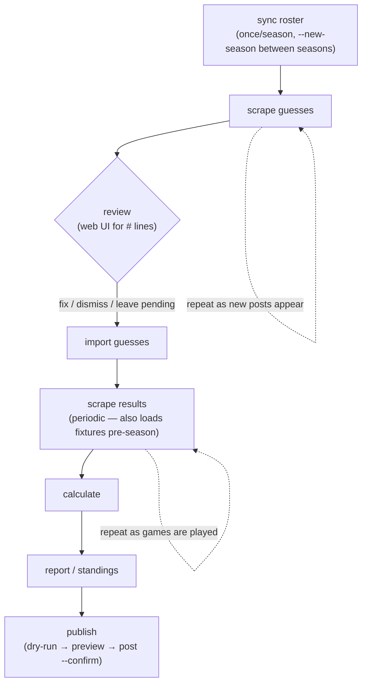
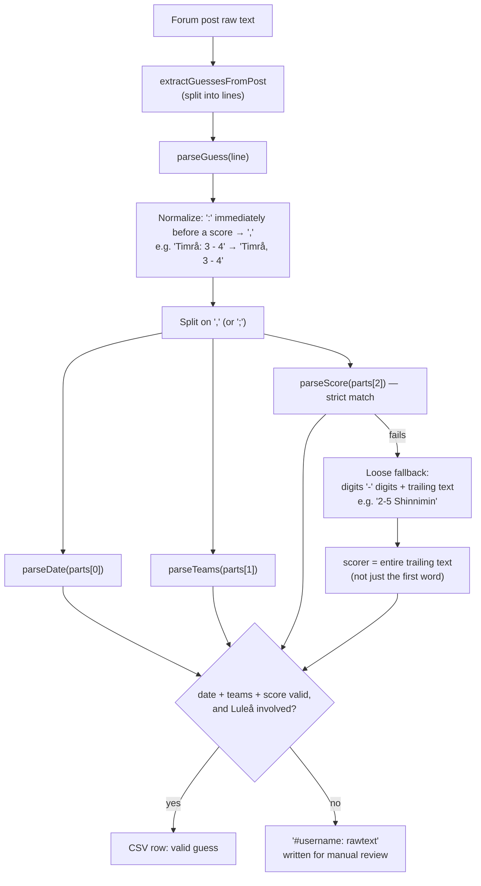
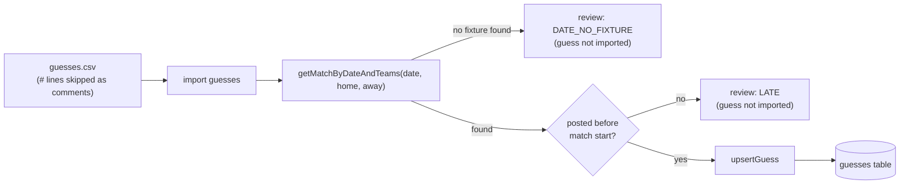
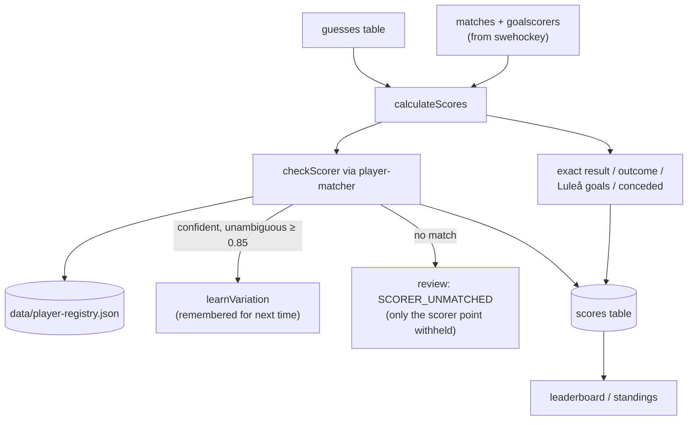
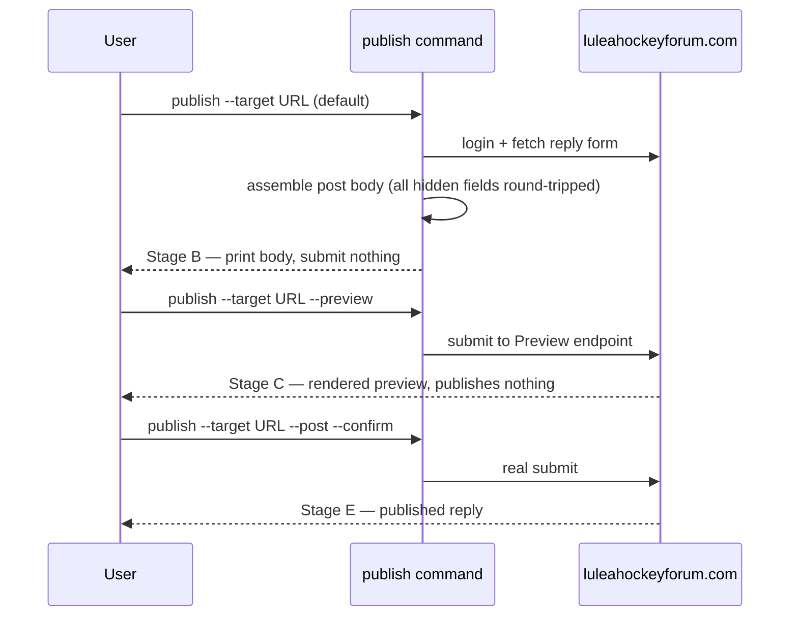
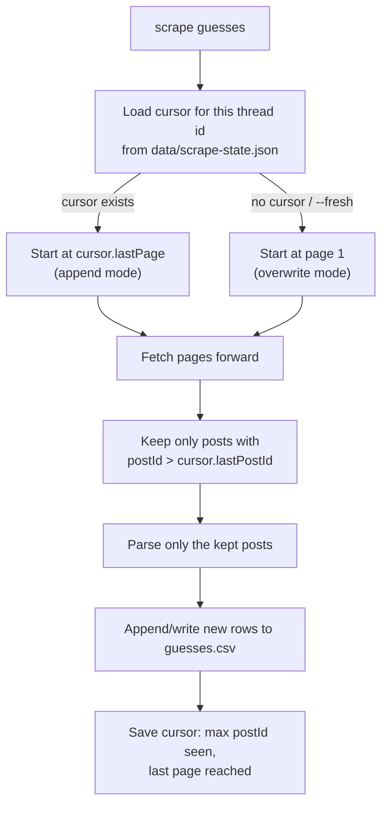
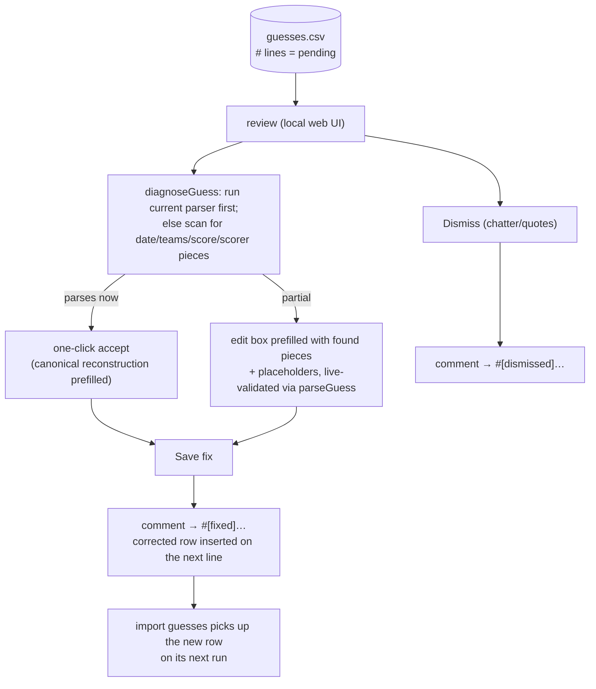

# Pipeline overview

End-to-end flow of LHFTips, from a forum post to a published standings table,
with the guess-parser format-tolerance fixes (2026-07-08) shown in place. See
[`player-matching.md`](./player-matching.md) for the scorer-matching/registry
details and [`legacy-migration.md`](./legacy-migration.md) for why the design
looks the way it does.

## 1. Operational loop

The commands you actually run, in order, and how often:

`scrape results` double-duties: before the season it inserts fixtures with
null scores; once games are played, the same command fills in scores and
goalscorers (see `parseSchedulePage` in `swehockey-scraper.js`).

`scrape guesses` doesn't re-fetch or re-parse the whole thread every time it
runs — see [Incremental scraping](#incremental-scraping-the-cursor) below.
Pagination itself stops on the forum's own authoritative page count (parsed
from "Sida X av Y"), not by guessing — see the note in `forum-scraper.js`
`parsePaginationInfo`.

## 2. Guess parsing (forum text → structured guess)

This is where the 2026-07-08 fixes live: a colon used instead of a comma
right before the score, and a scorer glued directly onto the score with no
separating comma.

Both normalization steps run on the whole line **before** the comma-split, so
they compose with the existing tolerant date/team/semicolon handling rather
than replacing it. Measured recovery against the real 2023-24 thread: 53 of
243 previously-unparsed posts (~22%) now parse correctly, with no regressions
(112/112 tests passing).

## 3. Import: matching a guess to a scheduled fixture

## 4. Scoring and scorer matching

Scorer ground truth is always the actual goalscorers of that game, never the
roster — the registry only assists matching and learns confident spellings
(see [`player-matching.md`](./player-matching.md) for the full model).

## 5. Publish ladder

`publish` never sends a real post without an explicit `--post --confirm`:

## Incremental scraping (the cursor)

`import`/`calculate` are already idempotent by construction (`UNIQUE(user_id,
match_id)` + upsert), so re-running them against the whole growing dataset
every time is always safe. `scrape guesses` is different: by default it
would re-fetch and re-write the entire thread from page 1, discarding any
manual fixes made to `#`-flagged review lines. `data/scrape-state.json`
fixes that with a per-thread cursor:

The cursor is keyed by thread id (extracted from the URL), so switching to a
new season's thread naturally starts fresh instead of reusing a stale
cursor. It's a plain JSON file rather than a DB table deliberately: `scrape
guesses` has never depended on the DB (it only writes a CSV — `import
guesses` is the DB-touching step), and keeping it that way means the cursor
survives independently of whatever DB file `import`/`calculate` happen to be
pointed at (including a throwaway test DB, per the testing method below).

## Polishing: the review UI

`review` serves a local web UI over the CSV's `#` lines — the posts the
parser couldn't handle. The CSV itself carries the review state: pending
items are plain `#` lines; handled ones are re-marked `#[fixed]` /
`#[dismissed]` in place (both still start with `#`, so `import guesses`
skips them as comments exactly as before). The fixed row is inserted
directly below its commented original, preserving the audit trail.

Because state lives in the file, fixes survive anything except a `--fresh`
re-scrape that overwrites the CSV — and even then the scrape cursor
(`postId`) means a normal incremental run never regenerates a handled line.
Newly scraped `#` lines embed the post timestamp
(`#Username @2026-09-19T18:00:00: …`), so a fix made through the UI keeps
the posted-before-match check meaningful; legacy lines without it import
with an empty timestamp (treated as valid — the human vetted it).

The scorer half of polishing is separate: `SCORER_UNMATCHED` entries in
`review-report.txt`, resolved with `map-player` (see
[`player-matching.md`](./player-matching.md)).

### Optional AI-assisted suggestions (wired in, inactive)

For items the local regex diagnosis can't fully resolve, the UI offers an
**"Ask AI"** button (hidden for items already showing "parses with current
parser" — those don't need it). It calls `POST /api/ai-suggest`, which goes
through `diagnoseGuessWithAI` in `src/parsers/ai/index.js` — a small provider
abstraction (`AIProvider = (rawText, defaultYear) => Promise<{isGuess,
reasoning, suggestion}>`) so a different backend can be swapped in later by
changing one `PROVIDER` assignment, no caller changes needed.

The only implementation, `src/parsers/ai/anthropic-provider.js`, has its
actual `client.messages.create(...)` call **commented out** — calling it
throws `AIProviderDisabledError`, which the route turns into a clean
`{ok:false, enabled:false, message}` the UI shows inline (not an alert).
Nothing fires a network request or costs anything until a developer
deliberately uncomments the call, runs `npm install @anthropic-ai/sdk`, and
sets `ANTHROPIC_API_KEY`. Verified live: the endpoint returns the disabled
message cleanly, and rejects calls against already-complete lines (400) —
both without touching the CSV.

## Testing the pipeline offline (no live scraping)

`guesses.csv` from a past season thread is a reusable, season-independent
test fixture: its `#`-prefixed lines are exactly the posts the parser
couldn't handle when the file was generated, so counting/inspecting them is a
direct measure of parser recall. To exercise the DB-import and scoring steps
without touching production data or scraping anything live:

1. Derive unique `(date, home_team, away_team)` triples from the CSV's own
   columns.
2. Insert them into a throwaway sql.js DB via `upsertMatch`, e.g. with a
   placeholder 0-0 score.
3. Run `importGuesses` / `calculateScores` against that DB
   (`initDatabase(path)` takes an explicit path, so production `lhftips.db`
   is never touched).

One caveat: synthetic fixtures have no real `match_time`, so
`import-guesses.js`'s post-timestamp-before-kickoff check defaults to
midnight and can flag same-day guesses as `LATE` — an artifact of the test
setup, not a real bug.
