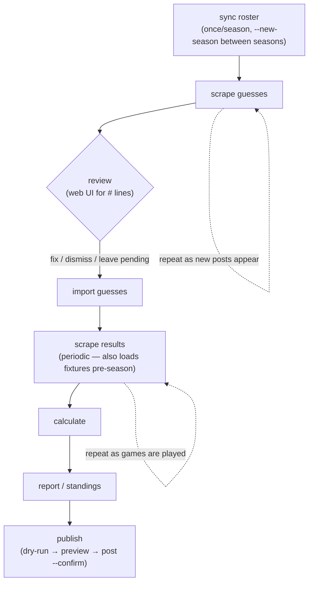
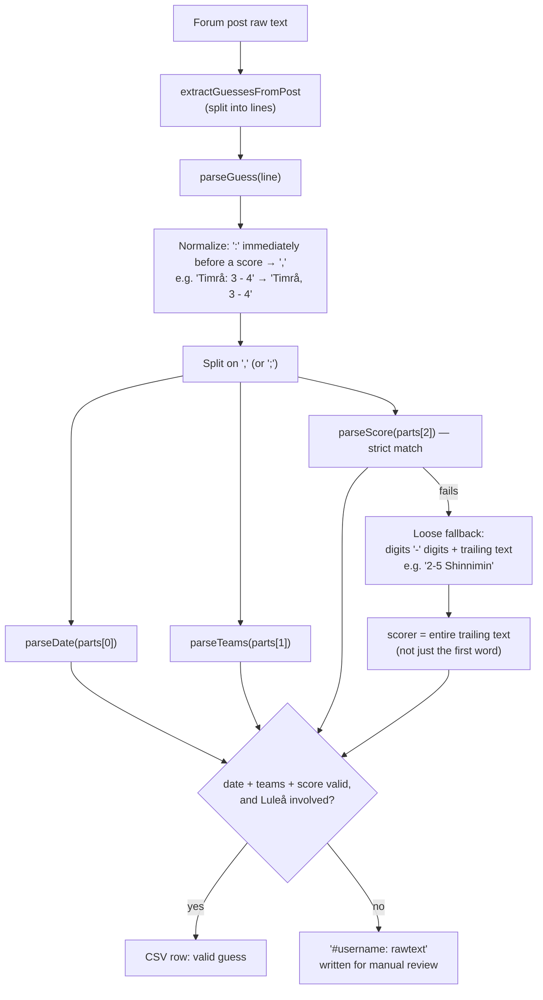
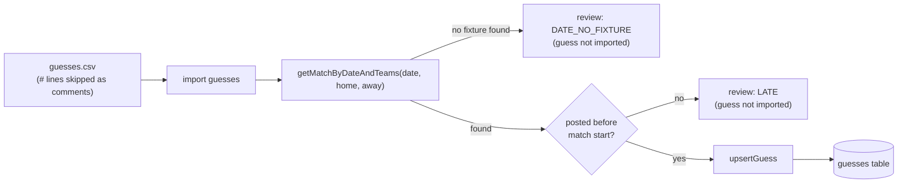
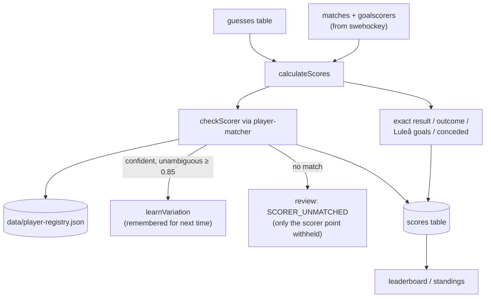
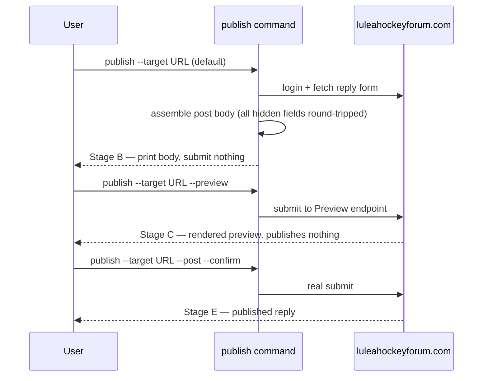
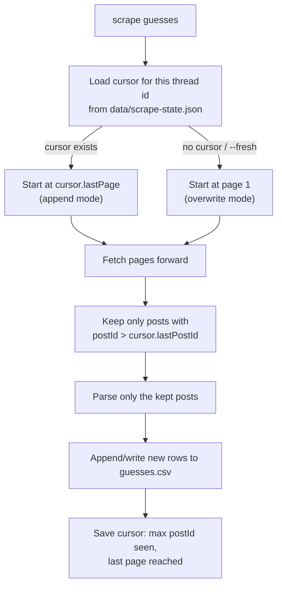
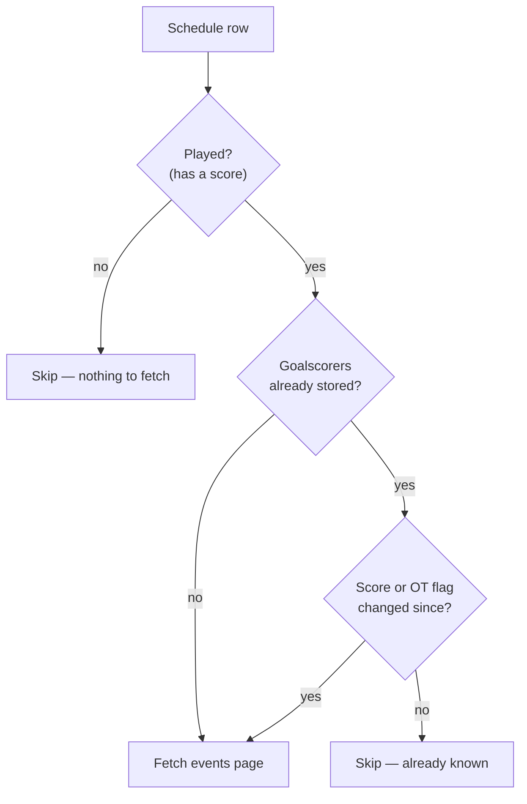
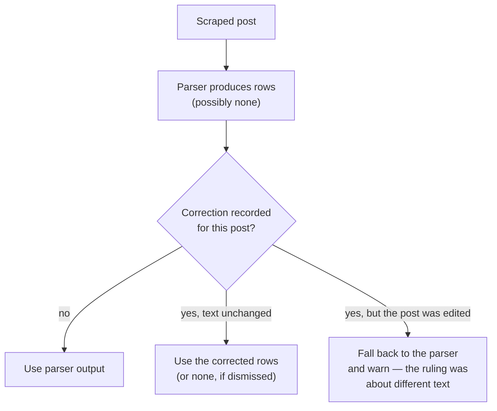
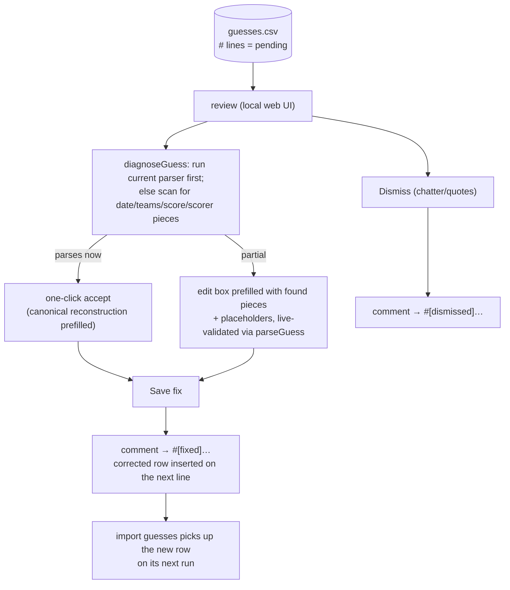

# Pipeline overview

End-to-end flow of LHFTips, from a forum post to a published standings table,
with the guess-parser format-tolerance fixes (2026-07-08) shown in place. See
[`player-matching.md`](./player-matching.md) for the scorer-matching/registry
details and [`legacy-migration.md`](./legacy-migration.md) for why the design
looks the way it does.

## 1. Operational loop

The commands you actually run, in order, and how often:



`scrape results` double-duties: before the season it inserts fixtures with
null scores; once games are played, the same command fills in scores and
goalscorers (see `parseSchedulePage` in `swehockey-scraper.js`).

`scrape guesses` doesn't re-fetch or re-parse the whole thread every time it
runs — see [Incremental scraping](#incremental-scraping-the-cursor) below.
Pagination itself stops on the forum's own authoritative page count (parsed
from "Sida X av Y"), not by guessing — see the note in `forum-scraper.js`
`parsePaginationInfo`.

## 2. Guess parsing (forum text → structured guess)

This is where the 2026-07-08 fixes live: a colon used instead of a comma
right before the score, and a scorer glued directly onto the score with no
separating comma.



Both normalization steps run on the whole line **before** the comma-split, so
they compose with the existing tolerant date/team/semicolon handling rather
than replacing it. Measured recovery against the real 2023-24 thread: 53 of
243 previously-unparsed posts (~22%) now parse correctly, with no regressions
(112/112 tests passing).

## 3. Import: matching a guess to a scheduled fixture



## 4. Scoring and scorer matching



Scorer ground truth is always the actual goalscorers of that game, never the
roster — the registry only assists matching and learns confident spellings
(see [`player-matching.md`](./player-matching.md) for the full model).

## 5. Publish ladder

`publish` never sends a real post without an explicit `--post --confirm`:



## Incremental scraping (the cursor)

`import`/`calculate` are already idempotent by construction (`UNIQUE(user_id,
match_id)` + upsert), so re-running them against the whole growing dataset
every time is always safe — and cheap enough that they simply do
(see [What is NOT incremental](#what-is-not-incremental-deliberately)).
The two stages that read the *network* do skip completed work, because there the
cost is real. `scrape guesses` is the first: by default it
would re-fetch and re-write the entire thread from page 1, discarding any
manual fixes made to `#`-flagged review lines. `data/scrape-state.json`
fixes that with a per-thread cursor:



The cursor is keyed by thread id (extracted from the URL), so switching to a
new season's thread naturally starts fresh instead of reusing a stale
cursor. Note that the cursor advances over every post it *read*,
including ones that produced no guess and were written out as a `#` line — so
improving the parser does not retroactively re-parse old posts. Use `--fresh`
for that, then re-apply the review file's `#[fixed]` lines.

### Rewinding — re-reading from a given post

The cursor only ever advances on its own, so re-reading old posts is a
deliberate act with its own command:

```
node src/index.js cursor show                  # where will the next scrape start?
node src/index.js cursor set 4711              # restart from post 4711
node src/index.js cursor set 4711 --page 12    # ...and skip straight to that page
node src/index.js cursor reset                 # forget it; read the whole thread
```

or as a one-off that leaves the saved cursor alone:

```
node src/index.js scrape guesses --from-post 4711
```

Two details worth knowing:

- **A post id says nothing about which page it is on** (forum post ids are
  global, not per-thread), so a rewind sweeps from page 1 unless you pass
  `--page`. Pass it when you know roughly where the post is and want to save
  the fetches.
- **Re-read posts replace their existing CSV lines rather than appending
  duplicates.** Every line is matched back to its post by username + timestamp
  — the same key the correction store uses — so data rows, pending `#` lines and
  `#[fixed]` markers for a re-read post are all dropped before the new rows are
  written. Without this a rewind would silently double every row it touched.
- The cursor is a high-water mark, so a rewind does **not** drag it backwards
  permanently: after the run it sits at the highest post id seen, and the next
  ordinary scrape carries on from there.

Note that `--start-page` on its own does **not** re-read anything: the saved
cursor's `lastPostId` still filters those posts out, so you would re-fetch the
pages and discard every post on them. Use `--from-post` or `cursor set`.

### Incremental results scraping

`scrape results` has the same problem on the swehockey side, and it is the more
expensive one: the schedule page is a single fetch, but each played game's
*events* page is a separate request with a 500 ms courtesy delay between them.
Re-reading all of them every run means a March run spends ~26 s sleeping to
re-learn goals that were settled in October.

So a game's events page is fetched only when there is something to learn from it
— `needsGoalscorerFetch` in `src/commands/scrape-results.js`:



The stored score has to be read *before* the match upsert, since afterwards it
always equals the scraped one and the comparison would never fire. A corrected
score or a result that turns out to have gone to overtime re-fetches just that
game; `--refresh-goalscorers` re-fetches everything.

### Incremental scoring

`calculate` skips any guess that already carries a score. Measured on a season
larger than a real one (52 played games, 1040 guesses):

| | before | now |
|---|---|---|
| first `calculate` | 1032 ms | **72 ms** |
| re-run, everything already scored | 896 ms | **42 ms** |
| `calculate --force` | — | 57 ms |

Most of that came from something unrelated to skipping: every `upsertScore` was
serialising the entire database to disk, because `prepare().run()` calls
`saveDatabase()` and sql.js implements `export()` by closing and reopening the
connection. Wrapping the pass in one transaction (as `import` already did) took
1032 ms to 72 ms on its own; skipping already-scored guesses takes it to 42 ms.

**The trade, stated plainly:** anything that changes an existing score — a
scorer verdict, a new `map-player` mapping, a corrected result — does not reach
guesses that were already scored unless you run `calculate --force`. Every
command that records such a change says so in its output, and so does
`calculate` itself whenever it skipped anything.

The review pass still runs over skipped guesses, so `review-report.txt` never
loses an item just because its guess was scored on an earlier run.

### What stays a full pass

`import guesses` re-reads the whole CSV each run (~80 ms for 836 rows). It is
idempotent by construction — `UNIQUE(user_id, match_id)` plus an upsert that
only moves forward — so a re-run changes nothing it has already stored. Note that
*parsing* is not repeated here: posts are parsed once, at scrape time, and only
for posts the cursor has not already seen. This stage just loads rows that were
parsed earlier.

The rule of thumb: **nothing already done is done again — but a decision that
changes an old answer needs `--force` to reach it.**

## Where manual work lives (and why it survives)

Everything derived is rebuilt on every run, so nothing a person decided may be
stored only inside something derived. Each kind of manual call therefore has its
own file under `data/`, keyed on a natural key rather than a row id:

| Decision | Where it lives | Keyed on |
|---|---|---|
| "this scorer guess counts / doesn't" | `data/scorer-verdicts.json` | user + match |
| "this spelling means this player" | `data/player-registry.json` | player name |
| "this post's rows should be X" | `data/guess-corrections.json` | user + post timestamp |
| "this post isn't a guess" | `data/guess-corrections.json` | user + post timestamp |
| how far the thread was read | `data/scrape-state.json` | thread id |
| cached AI suggestions | `data/scorer-suggestions.json` | spelling + goalscorers |

The consequence: **you can delete `lhftips.db` and `guesses.csv` entirely, re-run
the pipeline from scratch, and every manual judgement comes back.** Only the AI
cache costs anything to rebuild, and that is just time.

### Corrections vs. the CSV

`guesses.csv` is a derived artefact, not a record of decisions. A normal
incremental scrape appends and leaves earlier lines alone, so hand-edits there do
survive day to day — but `--fresh` regenerates the whole file, and `--fresh` is
exactly what you run after improving the parser. So every fix made in `review`
is *also* written to `data/guess-corrections.json`, and `scrape guesses` replays
those over the parser's output:



Like a scorer verdict, a correction is tied to the post text it was made about.
If the poster edits their post, the old ruling is **not** silently applied to the
new content — the scrape warns and falls back to the parser.

### Typo'd dates are repaired by rule, not one by one

Posters mistype the date constantly, and nearly always in a single field:

| Written | Posted | Real |
|---|---|---|
| `0023-10-14` | 2023-10-14 | a digit dropped |
| `1023-10-21` | 2023-10-20 | `1` typed for `2` |
| `2923-12-26` | 2023-12-26 | `9` typed for `0` |
| `2023-01-04` | 2024-01-04 | last year's year, written in January |
| `2024-04-12` | 2024-03-12 | month `04` typed for `03` |

All of these have the same ground truth. Rule 2.3 requires a guess to be posted
on match day or a few days before, so **the post timestamp says what the date
must have been**. At import, a date matching no fixture is retried with the
handful of single-field corrections that timestamp allows — and a candidate is
accepted only if a real scheduled fixture *between those two teams* exists on it.

That fixture check is what makes it safe to do automatically: the repair can
never invent a date, only select one the schedule already contains. It touches
only the year or the month, never the day. Repairs are reported as
`DATE_REPAIRED` in the review report; anything with two possible corrections is
reported as `DATE_AMBIGUOUS` and left for a person.

On the project's own `guesses.csv` this recovers **19 of 30** mistyped rows with
no manual work and no wrong repairs. The rest all wrote a date *before* they
posted, which is deliberately left alone — that is ambiguous between a mistyped
day and a genuinely late guess, and rule 2.7 disqualifies the latter, so only a
person should decide.

Those remaining cases are usually one typo shared by several posters (people copy
each other's line), so they are fixed once per date rather than once per row:

```
node src/index.js correct date 2023-09-08 2023-09-28
```

which rewrites every row carrying that date and records a durable correction for
each affected post.

For a guess that *parsed but parsed wrongly* — a typo'd year like `2923-12-26`
that yields a perfectly valid row matching no fixture — there is no `#` line, so
the review UI never offers it. Record those from the CLI:

```
node src/index.js correct set PM 2026-10-14T18:00:00 "2026-10-14, Lulea - Frolunda, 3-2, Brannstrom"
node src/index.js correct dismiss Bamsefar 2026-10-05T18:00:00
node src/index.js correct list
node src/index.js correct remove PM 2026-10-14T18:00:00
```

`set` and `dismiss` update `guesses.csv` immediately *and* record the decision,
so the fix applies now and again on every future scrape. `remove` forgets the
ruling and hands the post back to the parser on the next `--fresh`. It's a plain JSON file rather than a DB table deliberately: `scrape
guesses` has never depended on the DB (it only writes a CSV — `import
guesses` is the DB-touching step), and keeping it that way means the cursor
survives independently of whatever DB file `import`/`calculate` happen to be
pointed at (including a throwaway test DB, per the testing method below).

## Polishing: the review UI

`review` serves a local web UI over the CSV's `#` lines — the posts the
parser couldn't handle. The CSV itself carries the review state: pending
items are plain `#` lines; handled ones are re-marked `#[fixed]` /
`#[dismissed]` in place (both still start with `#`, so `import guesses`
skips them as comments exactly as before). The fixed row is inserted
directly below its commented original, preserving the audit trail.



Because state lives in the file, fixes survive anything except a `--fresh`
re-scrape that overwrites the CSV — and even then the scrape cursor
(`postId`) means a normal incremental run never regenerates a handled line.
Newly scraped `#` lines embed the post timestamp
(`#Username @2026-09-19T18:00:00: …`), so a fix made through the UI keeps
the posted-before-match check meaningful; legacy lines without it import
with an empty timestamp (treated as valid — the human vetted it).

The scorer half of polishing is separate: `SCORER_UNMATCHED` entries in
`review-report.txt`, resolved with `map-player` (see
[`player-matching.md`](./player-matching.md)).

### Optional AI-assisted suggestions (wired in, inactive)

For items the local regex diagnosis can't fully resolve, the UI offers an
**"Ask AI"** button (hidden for items already showing "parses with current
parser" — those don't need it). It calls `POST /api/ai-suggest`, which goes
through `diagnoseGuessWithAI` in `src/parsers/ai/index.js` — a small provider
abstraction (`AIProvider = (rawText, defaultYear) => Promise<{isGuess,
reasoning, suggestion}>`) so a different backend can be swapped in later by
changing one `PROVIDER` assignment, no caller changes needed.

The only implementation, `src/parsers/ai/anthropic-provider.js`, has its
actual `client.messages.create(...)` call **commented out** — calling it
throws `AIProviderDisabledError`, which the route turns into a clean
`{ok:false, enabled:false, message}` the UI shows inline (not an alert).
Nothing fires a network request or costs anything until a developer
deliberately uncomments the call, runs `npm install @anthropic-ai/sdk`, and
sets `ANTHROPIC_API_KEY`. Verified live: the endpoint returns the disabled
message cleanly, and rejects calls against already-complete lines (400) —
both without touching the CSV.

## Testing the pipeline offline (no live scraping)

`guesses.csv` from a past season thread is a reusable, season-independent
test fixture: its `#`-prefixed lines are exactly the posts the parser
couldn't handle when the file was generated, so counting/inspecting them is a
direct measure of parser recall. To exercise the DB-import and scoring steps
without touching production data or scraping anything live:

1. Derive unique `(date, home_team, away_team)` triples from the CSV's own
   columns.
2. Insert them into a throwaway sql.js DB via `upsertMatch`, e.g. with a
   placeholder 0-0 score.
3. Run `importGuesses` / `calculateScores` against that DB
   (`initDatabase(path)` takes an explicit path, so production `lhftips.db`
   is never touched).

One caveat: synthetic fixtures have no real `match_time`, so
`import-guesses.js`'s post-timestamp-before-kickoff check defaults to
midnight and can flag same-day guesses as `LATE` — an artifact of the test
setup, not a real bug.
